## Hi, I'm Milan

I build small, self-contained web things — games, puzzles, and the occasional tool to make building them nicer.

Everything public I've got, sorted by what it is:

---

### Apps

<table>
<tr>
<td width="176">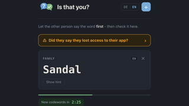</td>
<td><b><a href="https://github.com/MilanFox/Is-That-You">Is-That-You</a></b> 
Verify the person on the phone is really them — offline, zero-dependency PWA. 
<a href="https://is-that-you.vercel.app">live ↗</a></td>
</tr>
<tr>
<td width="176">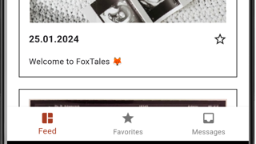</td>
<td><b><a href="https://github.com/MilanFox/Fox-Tales">Fox-Tales</a></b> <code>discontinued</code> 
Private family photo sharing for Android and iOS. Flutter + Firebase, finished to MVP.</td>
</tr>
<tr>
<td width="176">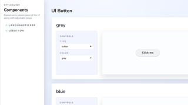</td>
<td><b><a href="https://github.com/MilanFox/Terra-Incognita">Terra-Incognita</a></b> <code>WIP</code> 
Bilingual geography quiz. The component library and i18n are done, the quiz isn't. 
<a href="https://terra-incognita.vercel.app">live ↗</a></td>
</tr>
</table>

### Games & Puzzles

<table>
<tr>
<td width="176">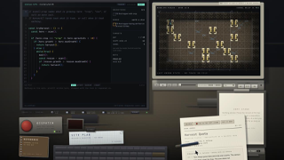</td>
<td><b><a href="https://github.com/MilanFox/bootstrap">BOOTSTRAP</a></b> 
Write real TypeScript for terraforming robots, then watch the recording. 33 work orders, no server. 
<i>An experiment in fully-agentic development — not one line written by hand.</i> 
<a href="https://bootstrap-the-game.vercel.app">live ↗</a></td>
</tr>
<tr>
<td width="176">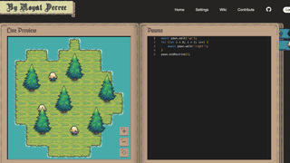</td>
<td><b><a href="https://github.com/MilanFox/By-Royal-Decree">By-Royal-Decree</a></b> 
Grid-based puzzle game — program medieval minions in an in-browser code editor. 
<a href="https://by-royal-decree.vercel.app">live ↗</a></td>
</tr>
<tr>
<td width="176">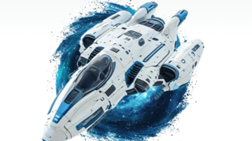</td>
<td><b><a href="https://github.com/MilanFox/Nebula">Nebula</a></b> 
Space-themed platform serving AoC-style coding puzzles, with accounts and progress. 
<a href="https://nebula-frontend-ten.vercel.app">live ↗</a></td>
</tr>
</table>

### Coding Challenges

<table>
<tr>
<td width="176">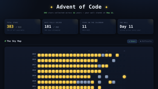</td>
<td><b><a href="https://github.com/MilanFox/Advent-of-Code">Advent-of-Code</a></b> 
My Advent of Code solutions. Vanilla JS, no dependencies, ASCII visualizations. 
<a href="https://milanfox.github.io/Advent-of-Code/">live ↗</a></td>
</tr>
</table>

### Experiments

<table>
<tr>
<td width="176">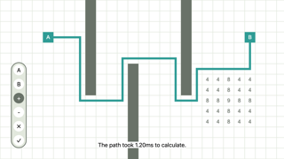</td>
<td><b><a href="https://github.com/MilanFox/Pathfinder-Playground">Pathfinder-Playground</a></b> <code>discontinued</code> 
Interactive A* visualizer — weight or block cells and watch it re-path. 
<a href="https://pathfinder-playground.vercel.app">live ↗</a></td>
</tr>
<tr>
<td width="176">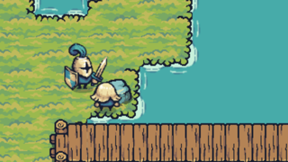</td>
<td><b><a href="https://github.com/MilanFox/Character-Controller">Character-Controller</a></b> <code>discontinued</code> 
Canvas playground — drive a knight around while an A*-driven minion hunts you. 
<a href="https://character-controller-henna.vercel.app/">live ↗</a></td>
</tr>
</table>

### Tooling

<table>
<tr>
<td width="176">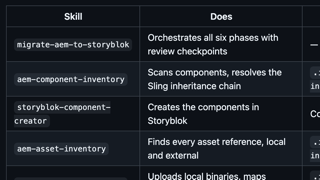</td>
<td><b><a href="https://github.com/MilanFox/migrate-aem-to-storyblok">migrate-aem-to-storyblok</a></b> 
Claude Code skills that migrate an AEM project's content into Storyblok, with review checkpoints.</td>
</tr>
<tr>
<td width="176">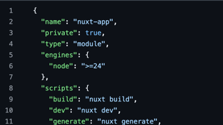</td>
<td><b><a href="https://github.com/MilanFox/Nuxt-Starter">Nuxt-Starter</a></b> 
The opinionated Nuxt 4 template I start projects from. Linting, testing and SCSS wired up.</td>
</tr>
</table>
